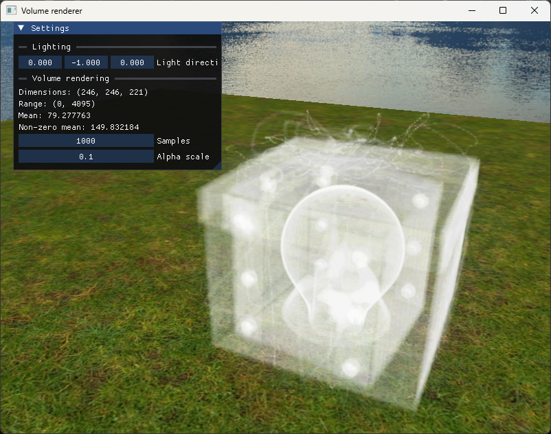

# Volume renderer

A slice based volume renderer based on [this Nvidia GPU Gem](https://developer.nvidia.com/gpugems/gpugems/part-vi-beyond-triangles/chapter-39-volume-rendering-techniques). The volume loader is configured for [this](https://www.cg.tuwien.ac.at/research/vis/datasets/) dataset from TU Wien, and testing has also been done on this. Work in progress!
